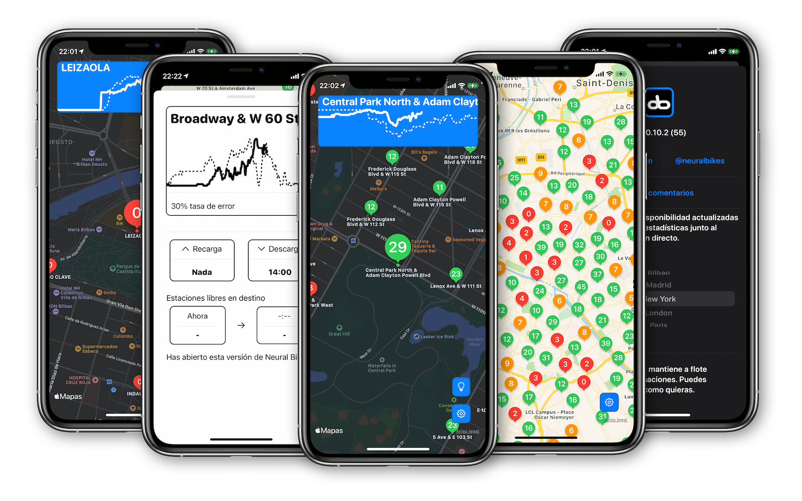

# Bicis

.

[Download link to the AppStore](http://app.neural.bike)

iOS app to check on the status of bike sharing services. Currently available for Bilbao, Madrid and New York. 

Gets the predictions from the [Neural Bikes](http://neural.bike) API and compares the real availability of each station with the predicted availability. The predictions are handled and created by the Machine Learning backend, [Neural Bikes](https://github.com/javierdemartin/neural-bikes).

## Tech Stack

MVVM & AppCoordinator pattern. Writen natively in Swift. Slowly migrating some parts to use Reactive Swift and learn it. 

## Acknowledgements

This app is completely free. I even removed Google Ads because I didn't feel comfortable using them. I'm planning on adding donation buttons to the app to help me maintain the development of this project. Meanwhile you can contribute and donate via Ko-Fi using the button above.
